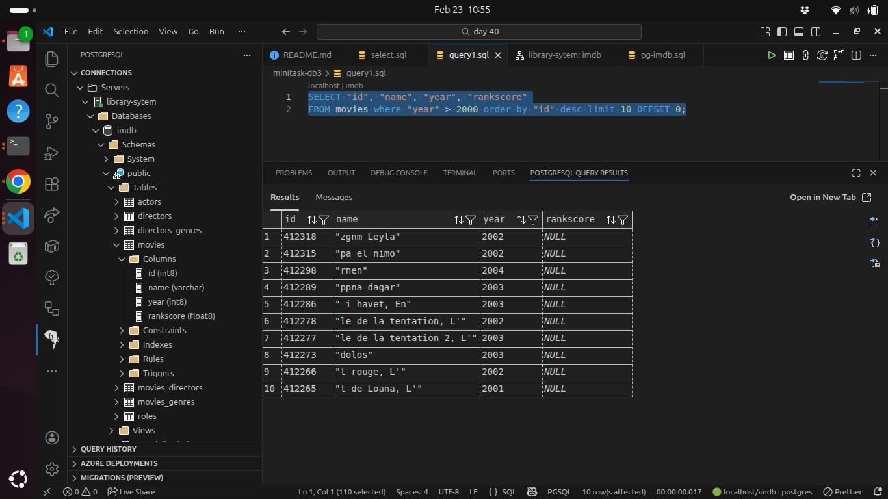
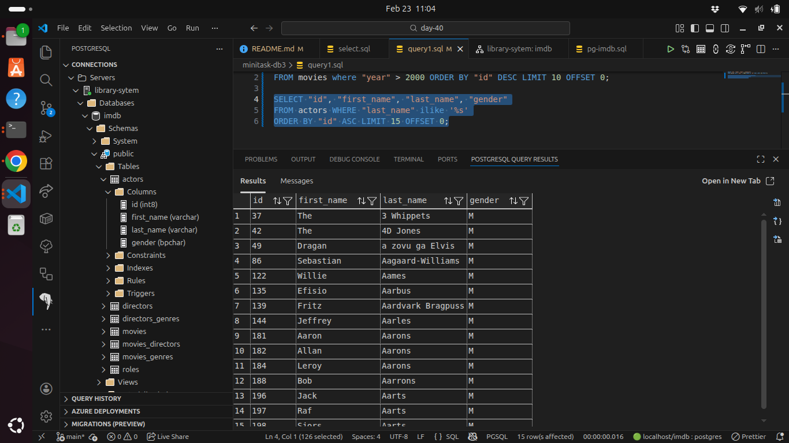
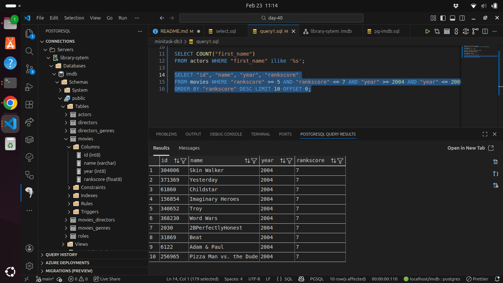
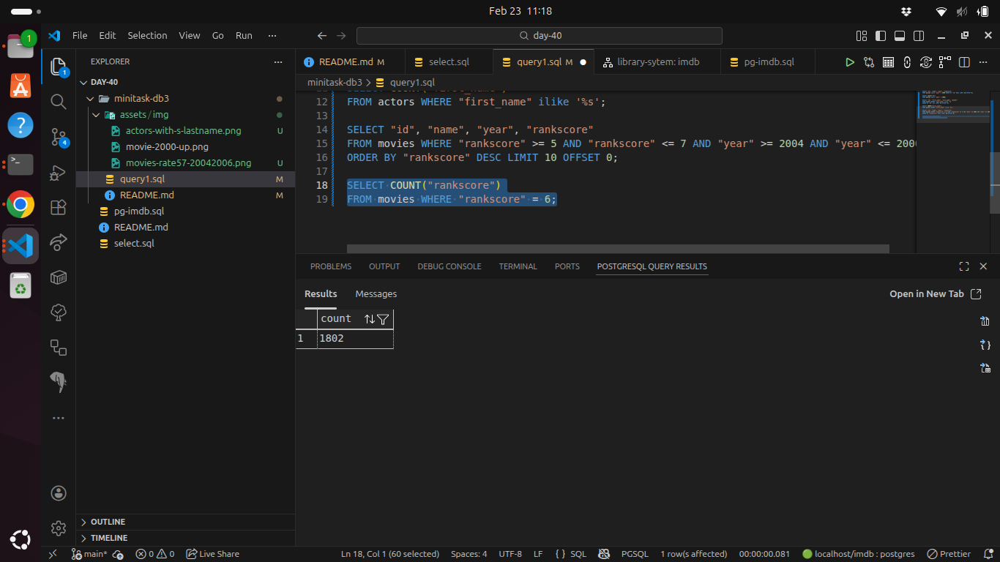
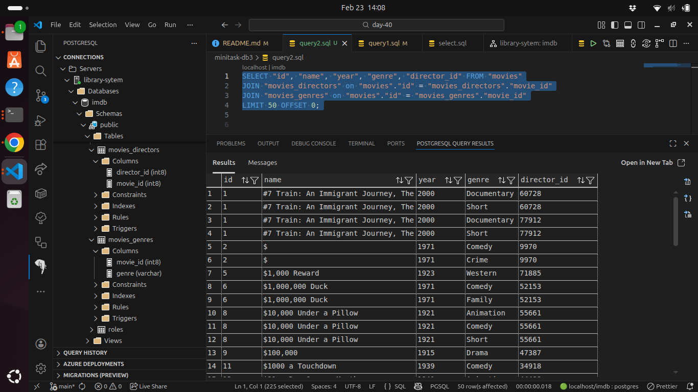
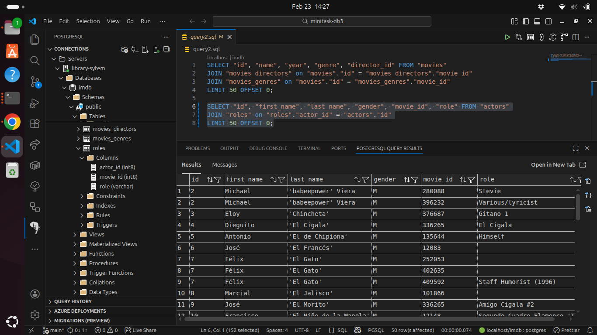
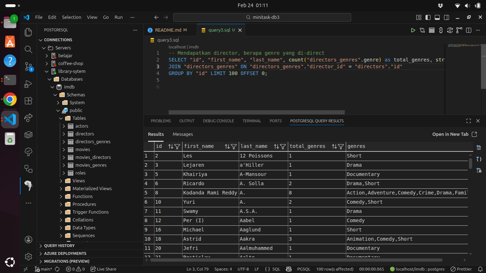
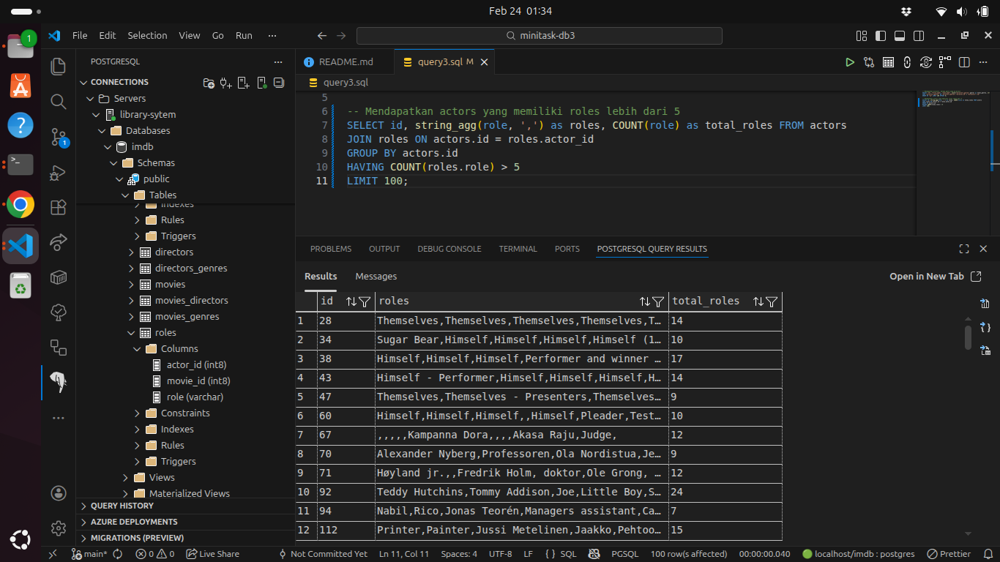
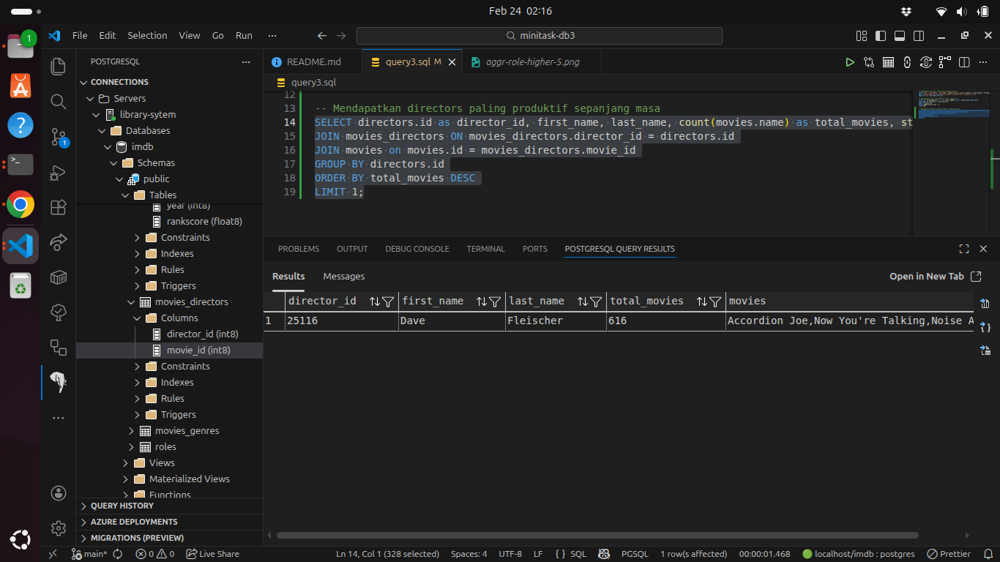

# Minitask (koda-b6-db3)

- Mencari movie dengan tahun rilis lebih dari tahun 2000

- Mencari actors dengan akhiran nama 's'

- Mencari movie dengan rating diantara 5 dan 7 dan tahun rilis 2004 sampai 2006

- menghitung jumlah movie dengan rating 6

- Kumpulkan pada repo koda-b6-db3 dengan nama file query1.sql

## UPDATE (QUERY JOIN TABLE)
- Melakukan join directors dan genres ke table movies, limit keluaran sebanyak 50

- Melakukan join movies dan roles berdasarkan table actors

- Update koda-b6-db3, dengan menambahkan file query2.sql

## UPDATE (AGREGATION)
- Mendapatkan director, berapa genre yang di-direct

- Mendapatkan actors yang memiliki roles lebih dari 5

- Mendapatkan directors paling produktif sepanjang masa

- Mendapatkan tahun tersibuk sepanjang masa

- Mendapatkan movies dengan genres yang dibuatkan menjadi 1 column (value dipisahkan dengan comma) dengan menggunakan string_agg
- Update repo koda-b6-db3, buat file query3.sql